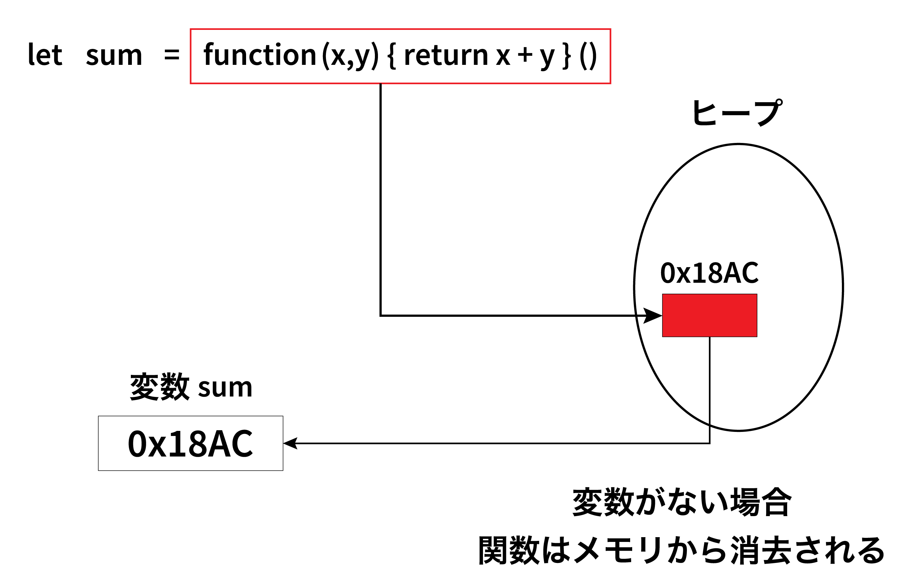

# 無名関数
- 通常の関数とラムダ関数で格納されるメモリの領域が異なる
- メモリの領域
    - コードセグメント（テキストセグメント、テキスト領域）: これは読み取り専用のメモリ領域で、実行可能なプログラムのコード（命令）が格納されます。これらの命令はプロセッサによって直接解釈・実行されます。
    - データセグメント: これはグローバル変数や静的変数が格納されるメモリ領域です。これらの変数はプログラムが実行されている間中、存在し続けます。
    - ヒープセグメント: ヒープは動的にメモリを確保するための領域で、プログラム実行中に要求されるときにメモリが割り当てられ、不要になると解放されます。
    - スタックセグメント: スタックは関数の呼び出しとそれに伴う局所変数の保存に使われるメモリ領域です。関数が呼び出されると、新たなスタックフレームが作られ、関数が終了するとそのフレームは破棄されます。スタックはプログラムによって自動的に管理されます。
- 通常の関数は定義されるとコードセグメント内の特定のメモリアドレスに格納される
- 対して無名関数はメモリ上で「関数オブジェクト」として扱われ、ヒープ領域に格納される


## 高階関数
- 関数を引数に受け取り、関数を出力として返す関数

## コールバック関数
- 引数として渡される関数

## 高階関数やコールバック関数を使用するメリット
- 処理の責任を分けることができる
- 関数を使い回せる
- 処理をより抽象化できる
- 総じて、コードの可読性や保守性向上につながる

## ステートレス関数とステートフル関数
- 通常の関数は、ステートレス関数。つまり状態を保持しない。
- 関数が定義したスコープ内の処理の結果を返す。したがって、同じ入力が与えられたら同じ結果が常に返される。
- 対して無名関数はステートフル（同じ入力を受けても異なる結果を返すことがある）
- それは無名関数は定義されたスコープの変数にアクセスすることができるという性質を持つためである。（グローバルスコープで定義されたらグローバル変数にアクセスできる）
- その性質を使って、クロージャを実装できる。

## クロージャ
- 高階関数を定義する
- 高階関数を変数で参照することで、変数を実行するたびに保持された高階関数内のスコープの変数やメソッドにアクセスし、結果を返す
- 変数やメソッドを外部から直接アクセスできないように隠蔽するためにも使われる(モジュールパターン)
```python
function myFun() {
   const value = 5;

   return {
      getValue: function() {
         return value;
      }
   }
}

const v = myFun();
console.log(v.getValue()); // 5
```
