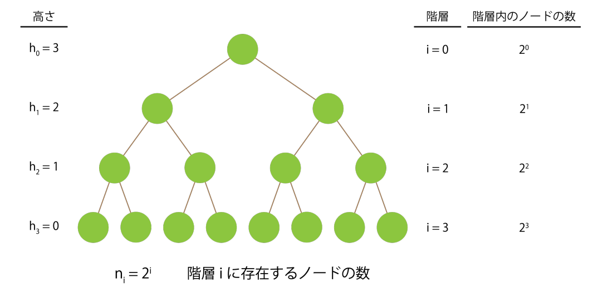
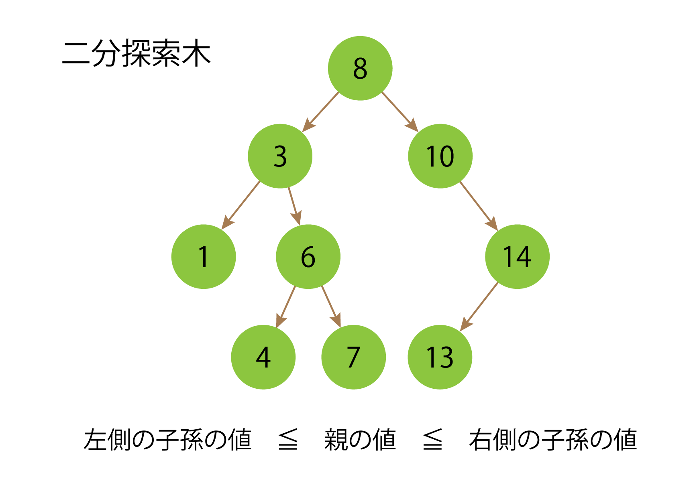
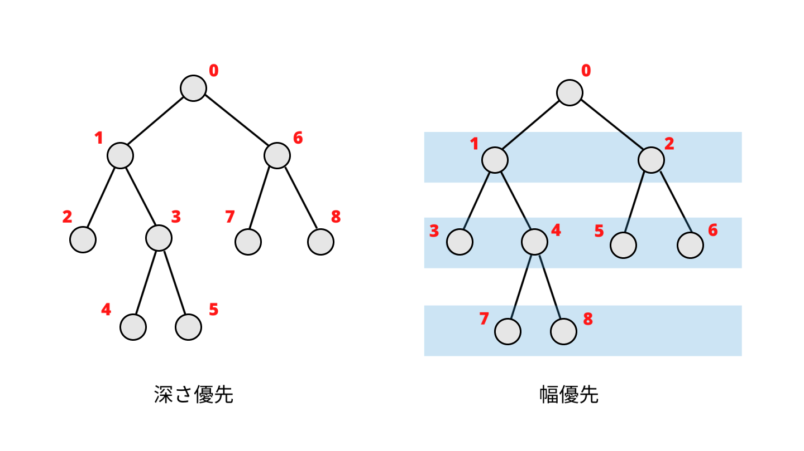

# 木構造

## 基礎知識
- 木
- 森
- 有向グラフ
- 無向グラフ
- 子孫
- 先祖
- 兄弟
- 根ノード
- 葉ノード
- 高さ
- 深さ

## 最もシンプルな二分木の実装
```python
class BinaryTree:
    def __init__(self, data) -> None:
        self.data = data
        # ノードの左の子
        self.left = None
        # ノードの右の子
        self.right = None

binaryTree = BinaryTree(1)
node2 = BinaryTree(2)
node3 = BinaryTree(3)

binaryTree.left = node2
binaryTree.right = node3
```

## 完全二分木の数学的性質


## 二分探索木


- 木の各ノードが「左の子孫の値 ≤ 親(x)の値 ≤ 右の子孫の値」という制約を持つ
- 完全な二分探索木は、高さがO(logn)であることが保証されています。これは、二分探索の処理時間が O(logn) であることを意味しています。つまり、探索にかかる時間は木の高さに比例します。

## 深さ優先探索


## 幅優先探索


## 最大ヒープ
- 親ノードが子ノードより必ず大きい完全二分木
- max-heapifyは親ノードと子ノードの大小関係を確認し、子ノードが大きければ、親ノードと入れ替えることで最大ヒープを作成するアルゴリズム